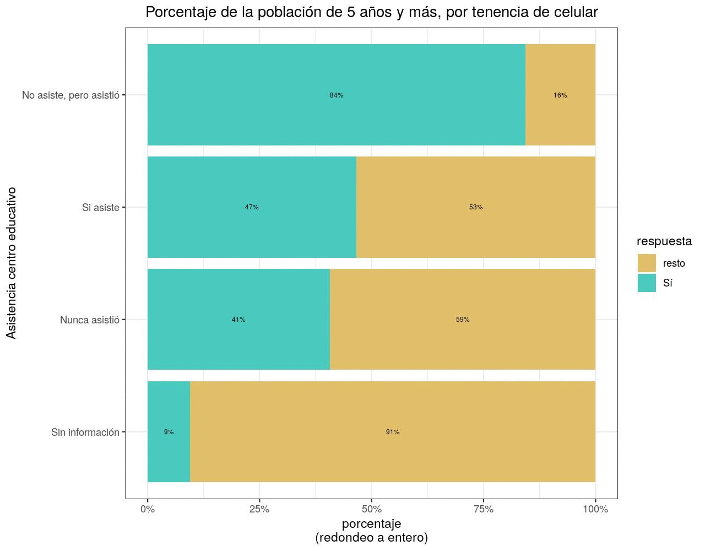

```{r setup, include=FALSE}
knitr::opts_chunk$set(
  echo = TRUE,
  collapse=TRUE,
  out.width = '100%',
  fig.width = 10,
  dpi = 300,
  fig.path = "img/"
)
```

<!-- Este .md fue generado a partir del .Rmd homónimo. Edítese el .Rmd -->

## Datos fuente

* Archivo `Personas_ENH18.sav`
* [URL directo](https://archivo.one.gob.do/catalogo-datos/datasets/ENHOGAR/ENHOGAR-2018-Base-SPSS-PUB/Personas_ENH18.sav)
* [Página raíz](https://archivo.one.gob.do/recursos-automatizados/bases-de-datos)

## Paquetes, funciones

```{r, message=FALSE, warning=FALSE}
library(foreign)
source('R/funciones.R')
```

## Lectura y preparación de datos

```{r, message=FALSE, warning=FALSE}
d <- read.spss('data/Personas_ENH18.sav') 
nom_cols <- attr(d, 'variable.labels')
df <- as.data.frame(d)
colnames(df) <- nom_cols
df$`H203. ¿Cuántos años cumplidos tiene nombre?` <- as.numeric(
  as.character(df$`H203. ¿Cuántos años cumplidos tiene nombre?`))
levels(df$`H202. ¿Es (nombre) varón o hembra?`) <- c('Hombre', 'Mujer')
```

## Gráficos, resúmenes

### PC, laptops, tabletas

```{r, message=FALSE, warning=FALSE}
categorias <- c('provincias', 'regiones', 'estratos', 'urbano_rural', 'hombre_mujer', 'grupo_socioecon')
titulo_grafico <- paste0('Porcentaje de la población de 5 años y más, ',
                         'por tenencia de computadora, laptop, tableta')

# Imprimir gráficos en este documento
sapply(
  categorias,
  function(x) {
    ba <- barras_apiladas_condicion_o(
      categorias = x,
      titulo_grafico = titulo_grafico)
    print(ba)
  })

# Exportar a imágenes
sapply(
  categorias,
  function(x) {
    ba <- barras_apiladas_condicion_o(
      categorias = x,
      titulo_grafico = titulo_grafico)
    jpeg(filename = paste0('img/', x, '_pc_tableta', '.jpg'), width = 1280, height = 1000, res = 150)
    print(ba$`gráfico`)
    dev.off()
  })
```

### Celulares

```{r, message=FALSE, warning=FALSE}
titulo_grafico <- 'Porcentaje de la población de 5 años y más, por tenencia de celular'

# Imprimir gráficos en este documento
sapply(
  categorias,
  function(x) {
    ba <- barras_apiladas_condicion_o(
      categorias = x,
      titulo_grafico = titulo_grafico)
    print(ba)
  })


# Exportar a imágenes
sapply(
  categorias,
  function(x) {
    ba <- barras_apiladas_condicion_o(
      categorias = x,
      titulo_grafico = titulo_grafico,
      patron_cols = '^H406')
    jpeg(filename = paste0('img/', x, '_celular', '.jpg'), width = 1280, height = 1000, res = 150)
    print(ba$`gráfico`)
    dev.off()
  })
```


## Outreach

> ENHOGAR 2018, TIC. Y pensar que la #raspberrypi usa la misma arquitectura de CPU que los celulares. En fin, que ampliar cobertura de docencia virtual, sin contar con el software libre, yo es que no lo veo

