ENHOGAR-2018, TIC
================
José Ramón Martínez Batlle

<!-- Este .md fue generado a partir del .Rmd homónimo. Edítese el .Rmd -->

## Datos fuente

  - Archivo `Personas_ENH18.sav`
  - [URL
    directo](https://archivo.one.gob.do/catalogo-datos/datasets/ENHOGAR/ENHOGAR-2018-Base-SPSS-PUB/Personas_ENH18.sav)
  - [Página
    raíz](https://archivo.one.gob.do/recursos-automatizados/bases-de-datos)

## Paquetes, funciones

``` r
library(foreign)
source('R/funciones.R')
```

## Lectura y preparación de datos

``` r
d <- read.spss('data/Personas_ENH18.sav') 
nom_cols <- attr(d, 'variable.labels')
df <- as.data.frame(d)
colnames(df) <- nom_cols
df$`H203. ¿Cuántos años cumplidos tiene nombre?` <- as.numeric(
  as.character(df$`H203. ¿Cuántos años cumplidos tiene nombre?`))
levels(df$`H202. ¿Es (nombre) varón o hembra?`) <- c('Hombre', 'Mujer')
```

## Gráficos, resúmenes

### PC, laptops, tabletas

``` r
categorias <- c('provincias', 'regiones', 'estratos', 'urbano_rural', 'hombre_mujer', 'grupo_socioecon')
titulo_grafico <- paste0('Porcentaje de la población de 5 años y más, ',
                         'por tenencia de computadora, laptop, tableta')

# Imprimir gráficos en este documento
sapply(
  categorias,
  function(x) {
    ba <- barras_apiladas_condicion_o(
      categorias = x,
      titulo_grafico = titulo_grafico)
    print(ba)
  })
## $resumen_tibble
## # A tibble: 32 x 3
##    provincias            Sí resto
##    <fct>              <dbl> <dbl>
##  1 Distrito Nacional 0.280  0.720
##  2 Azua              0.0730 0.927
##  3 Bahoruco          0.0540 0.946
##  4 Barahona          0.0668 0.933
##  5 Dajabón           0.0670 0.933
##  6 Duarte            0.108  0.892
##  7 Elías Piña        0.0439 0.956
##  8 El Seibo          0.0706 0.929
##  9 Espaillat         0.107  0.893
## 10 Independencia     0.0551 0.945
## # … with 22 more rows
## 
## $resumen_md
## 
## 
## |provincias             |Sí    |resto |
## |:----------------------|:-----|:-----|
## |Distrito Nacional      |28.0% |72.0% |
## |Azua                   |7.3%  |92.7% |
## |Bahoruco               |5.4%  |94.6% |
## |Barahona               |6.7%  |93.3% |
## |Dajabón                |6.7%  |93.3% |
## |Duarte                 |10.8% |89.2% |
## |Elías Piña             |4.4%  |95.6% |
## |El Seibo               |7.1%  |92.9% |
## |Espaillat              |10.7% |89.3% |
## |Independencia          |5.5%  |94.5% |
## |La Altagracia          |12.5% |87.5% |
## |La Romana              |15.3% |84.7% |
## |La Vega                |10.3% |89.7% |
## |María Trinidad Sánchez |7.2%  |92.8% |
## |Monte Cristi           |6.9%  |93.1% |
## |Pedernales             |5.7%  |94.3% |
## |Peravia                |9.4%  |90.6% |
## |Puerto Plata           |12.5% |87.5% |
## |Hermanas Mirabal       |8.7%  |91.3% |
## |Samaná                 |6.6%  |93.4% |
## |San Cristóbal          |7.8%  |92.2% |
## |San Juan               |6.3%  |93.7% |
## |San Pedro de Macorís   |9.3%  |90.7% |
## |Sánchez Ramírez        |8.2%  |91.8% |
## |Santiago               |16.8% |83.2% |
## |Santiago Rodríguez     |9.2%  |90.8% |
## |Valverde               |10.7% |89.3% |
## |Monseñor Nouel         |11.4% |88.6% |
## |Monte Plata            |4.4%  |95.6% |
## |Hato Mayor             |9.4%  |90.6% |
## |San José de Ocoa       |5.6%  |94.4% |
## |Santo Domingo          |15.3% |84.7% |
## 
## $gráfico
```

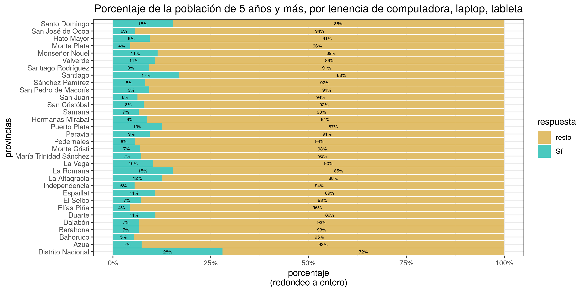

    ## 
    ## $resumen_tibble
    ## # A tibble: 10 x 3
    ##    regiones           Sí resto
    ##    <fct>           <dbl> <dbl>
    ##  1 Cibao Norte    0.151  0.849
    ##  2 Cibao Sur      0.101  0.899
    ##  3 Cibao Nordeste 0.0909 0.909
    ##  4 Cibao Noroeste 0.0883 0.912
    ##  5 Valdesia       0.0788 0.921
    ##  6 Enriquillo     0.0610 0.939
    ##  7 El Valle       0.0588 0.941
    ##  8 Del Yuma       0.129  0.871
    ##  9 Higuamo        0.0784 0.922
    ## 10 Metropolitana  0.191  0.809
    ## 
    ## $resumen_md
    ## 
    ## 
    ## |regiones       |Sí    |resto |
    ## |:--------------|:-----|:-----|
    ## |Cibao Norte    |15.1% |84.9% |
    ## |Cibao Sur      |10.1% |89.9% |
    ## |Cibao Nordeste |9.1%  |90.9% |
    ## |Cibao Noroeste |8.8%  |91.2% |
    ## |Valdesia       |7.9%  |92.1% |
    ## |Enriquillo     |6.1%  |93.9% |
    ## |El Valle       |5.9%  |94.1% |
    ## |Del Yuma       |12.9% |87.1% |
    ## |Higuamo        |7.8%  |92.2% |
    ## |Metropolitana  |19.1% |80.9% |
    ## 
    ## $gráfico

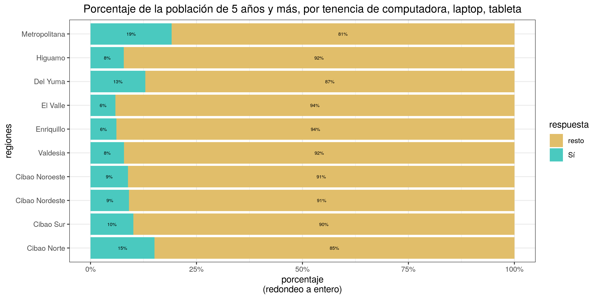

    ## 
    ## $resumen_tibble
    ## # A tibble: 4 x 3
    ##   estratos                    Sí resto
    ##   <fct>                    <dbl> <dbl>
    ## 1 Ciudad de Santo Domingo 0.200  0.800
    ## 2 Grandes Ciudades        0.162  0.838
    ## 3 Resto Urbano            0.0965 0.904
    ## 4 Rural                   0.0584 0.942
    ## 
    ## $resumen_md
    ## 
    ## 
    ## |estratos                |Sí    |resto |
    ## |:-----------------------|:-----|:-----|
    ## |Ciudad de Santo Domingo |20.0% |80.0% |
    ## |Grandes Ciudades        |16.2% |83.8% |
    ## |Resto Urbano            |9.6%  |90.4% |
    ## |Rural                   |5.8%  |94.2% |
    ## 
    ## $gráfico

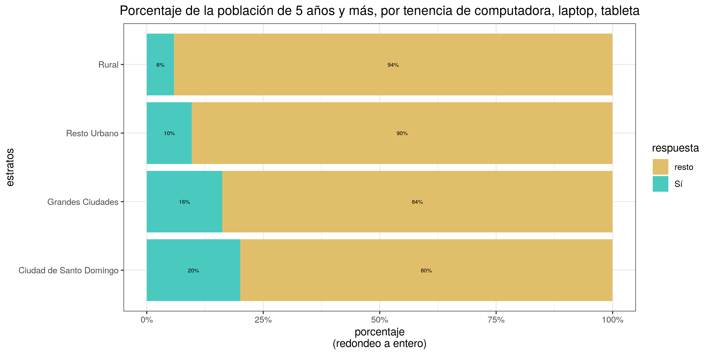

    ## 
    ## $resumen_tibble
    ## # A tibble: 2 x 3
    ##   urbano_rural     Sí resto
    ##   <fct>         <dbl> <dbl>
    ## 1 Urbano       0.155  0.845
    ## 2 Rural        0.0584 0.942
    ## 
    ## $resumen_md
    ## 
    ## 
    ## |urbano_rural |Sí    |resto |
    ## |:------------|:-----|:-----|
    ## |Urbano       |15.5% |84.5% |
    ## |Rural        |5.8%  |94.2% |
    ## 
    ## $gráfico


    ## 
    ## $resumen_tibble
    ## # A tibble: 2 x 3
    ##   hombre_mujer    Sí resto
    ##   <fct>        <dbl> <dbl>
    ## 1 Hombre       0.138 0.862
    ## 2 Mujer        0.136 0.864
    ## 
    ## $resumen_md
    ## 
    ## 
    ## |hombre_mujer |Sí    |resto |
    ## |:------------|:-----|:-----|
    ## |Hombre       |13.8% |86.2% |
    ## |Mujer        |13.6% |86.4% |
    ## 
    ## $gráfico

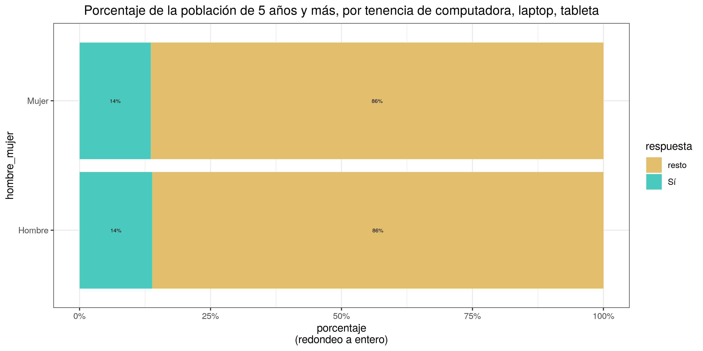

    ## 
    ## $resumen_tibble
    ## # A tibble: 5 x 3
    ##   grupo_socioecon        Sí resto
    ##   <fct>               <dbl> <dbl>
    ## 1 Muy bajo           0.0205 0.979
    ## 2 Bajo               0.0434 0.957
    ## 3 Medio bajo         0.0834 0.917
    ## 4 Medio y Medio alto 0.176  0.824
    ## 5 Alto               0.429  0.571
    ## 
    ## $resumen_md
    ## 
    ## 
    ## |grupo_socioecon    |Sí    |resto |
    ## |:------------------|:-----|:-----|
    ## |Muy bajo           |2.1%  |97.9% |
    ## |Bajo               |4.3%  |95.7% |
    ## |Medio bajo         |8.3%  |91.7% |
    ## |Medio y Medio alto |17.6% |82.4% |
    ## |Alto               |42.9% |57.1% |
    ## 
    ## $gráfico

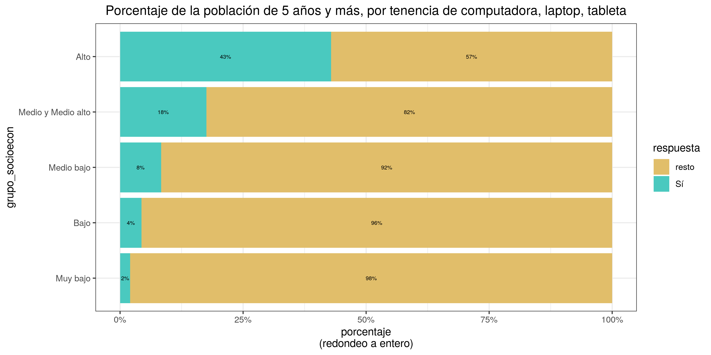

    ##                provincias   regiones     estratos    urbano_rural hombre_mujer
    ## resumen_tibble List,3       List,3       List,3      List,3       List,3      
    ## resumen_md     Character,34 Character,12 Character,6 Character,4  Character,4 
    ## gráfico        List,9       List,9       List,9      List,9       List,9      
    ##                grupo_socioecon
    ## resumen_tibble List,3         
    ## resumen_md     Character,7    
    ## gráfico        List,9
    
    # Exportar a imágenes
    sapply(
      categorias,
      function(x) {
        ba <- barras_apiladas_condicion_o(
          categorias = x,
          titulo_grafico = titulo_grafico)
        jpeg(filename = paste0('img/', x, '_pc_tableta', '.jpg'), width = 1280, height = 1000, res = 150)
        print(ba$`gráfico`)
        dev.off()
      })
    ##      provincias.png        regiones.png        estratos.png    urbano_rural.png 
    ##                   2                   2                   2                   2 
    ##    hombre_mujer.png grupo_socioecon.png 
    ##                   2                   2

### Celulares

``` r
titulo_grafico <- 'Porcentaje de la población de 5 años y más, por tenencia de celular'

# Imprimir gráficos en este documento
sapply(
  categorias,
  function(x) {
    ba <- barras_apiladas_condicion_o(
      categorias = x,
      titulo_grafico = titulo_grafico)
    print(ba)
  })
## $resumen_tibble
## # A tibble: 32 x 3
##    provincias            Sí resto
##    <fct>              <dbl> <dbl>
##  1 Distrito Nacional 0.280  0.720
##  2 Azua              0.0730 0.927
##  3 Bahoruco          0.0540 0.946
##  4 Barahona          0.0668 0.933
##  5 Dajabón           0.0670 0.933
##  6 Duarte            0.108  0.892
##  7 Elías Piña        0.0439 0.956
##  8 El Seibo          0.0706 0.929
##  9 Espaillat         0.107  0.893
## 10 Independencia     0.0551 0.945
## # … with 22 more rows
## 
## $resumen_md
## 
## 
## |provincias             |Sí    |resto |
## |:----------------------|:-----|:-----|
## |Distrito Nacional      |28.0% |72.0% |
## |Azua                   |7.3%  |92.7% |
## |Bahoruco               |5.4%  |94.6% |
## |Barahona               |6.7%  |93.3% |
## |Dajabón                |6.7%  |93.3% |
## |Duarte                 |10.8% |89.2% |
## |Elías Piña             |4.4%  |95.6% |
## |El Seibo               |7.1%  |92.9% |
## |Espaillat              |10.7% |89.3% |
## |Independencia          |5.5%  |94.5% |
## |La Altagracia          |12.5% |87.5% |
## |La Romana              |15.3% |84.7% |
## |La Vega                |10.3% |89.7% |
## |María Trinidad Sánchez |7.2%  |92.8% |
## |Monte Cristi           |6.9%  |93.1% |
## |Pedernales             |5.7%  |94.3% |
## |Peravia                |9.4%  |90.6% |
## |Puerto Plata           |12.5% |87.5% |
## |Hermanas Mirabal       |8.7%  |91.3% |
## |Samaná                 |6.6%  |93.4% |
## |San Cristóbal          |7.8%  |92.2% |
## |San Juan               |6.3%  |93.7% |
## |San Pedro de Macorís   |9.3%  |90.7% |
## |Sánchez Ramírez        |8.2%  |91.8% |
## |Santiago               |16.8% |83.2% |
## |Santiago Rodríguez     |9.2%  |90.8% |
## |Valverde               |10.7% |89.3% |
## |Monseñor Nouel         |11.4% |88.6% |
## |Monte Plata            |4.4%  |95.6% |
## |Hato Mayor             |9.4%  |90.6% |
## |San José de Ocoa       |5.6%  |94.4% |
## |Santo Domingo          |15.3% |84.7% |
## 
## $gráfico
```

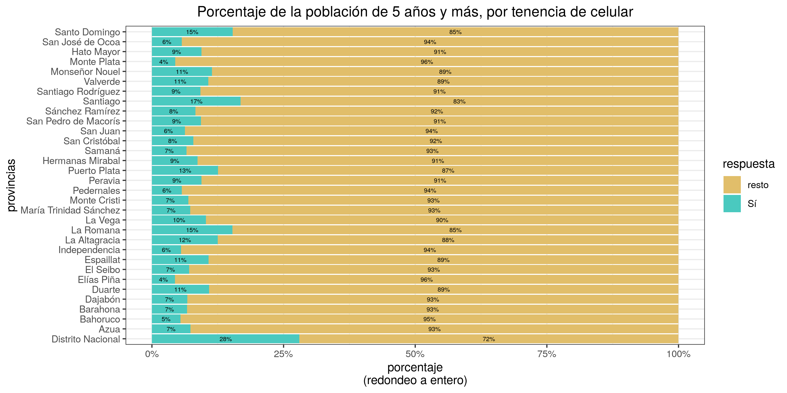

    ## 
    ## $resumen_tibble
    ## # A tibble: 10 x 3
    ##    regiones           Sí resto
    ##    <fct>           <dbl> <dbl>
    ##  1 Cibao Norte    0.151  0.849
    ##  2 Cibao Sur      0.101  0.899
    ##  3 Cibao Nordeste 0.0909 0.909
    ##  4 Cibao Noroeste 0.0883 0.912
    ##  5 Valdesia       0.0788 0.921
    ##  6 Enriquillo     0.0610 0.939
    ##  7 El Valle       0.0588 0.941
    ##  8 Del Yuma       0.129  0.871
    ##  9 Higuamo        0.0784 0.922
    ## 10 Metropolitana  0.191  0.809
    ## 
    ## $resumen_md
    ## 
    ## 
    ## |regiones       |Sí    |resto |
    ## |:--------------|:-----|:-----|
    ## |Cibao Norte    |15.1% |84.9% |
    ## |Cibao Sur      |10.1% |89.9% |
    ## |Cibao Nordeste |9.1%  |90.9% |
    ## |Cibao Noroeste |8.8%  |91.2% |
    ## |Valdesia       |7.9%  |92.1% |
    ## |Enriquillo     |6.1%  |93.9% |
    ## |El Valle       |5.9%  |94.1% |
    ## |Del Yuma       |12.9% |87.1% |
    ## |Higuamo        |7.8%  |92.2% |
    ## |Metropolitana  |19.1% |80.9% |
    ## 
    ## $gráfico

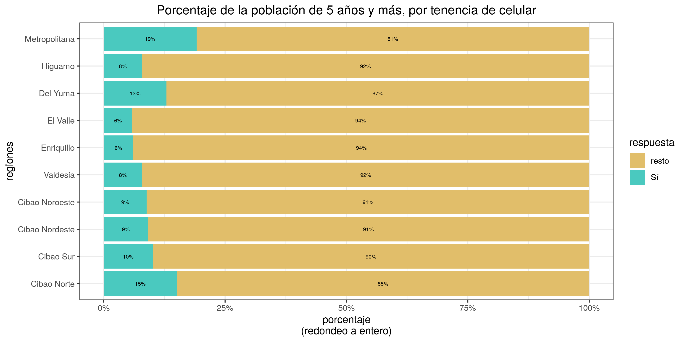

    ## 
    ## $resumen_tibble
    ## # A tibble: 4 x 3
    ##   estratos                    Sí resto
    ##   <fct>                    <dbl> <dbl>
    ## 1 Ciudad de Santo Domingo 0.200  0.800
    ## 2 Grandes Ciudades        0.162  0.838
    ## 3 Resto Urbano            0.0965 0.904
    ## 4 Rural                   0.0584 0.942
    ## 
    ## $resumen_md
    ## 
    ## 
    ## |estratos                |Sí    |resto |
    ## |:-----------------------|:-----|:-----|
    ## |Ciudad de Santo Domingo |20.0% |80.0% |
    ## |Grandes Ciudades        |16.2% |83.8% |
    ## |Resto Urbano            |9.6%  |90.4% |
    ## |Rural                   |5.8%  |94.2% |
    ## 
    ## $gráfico

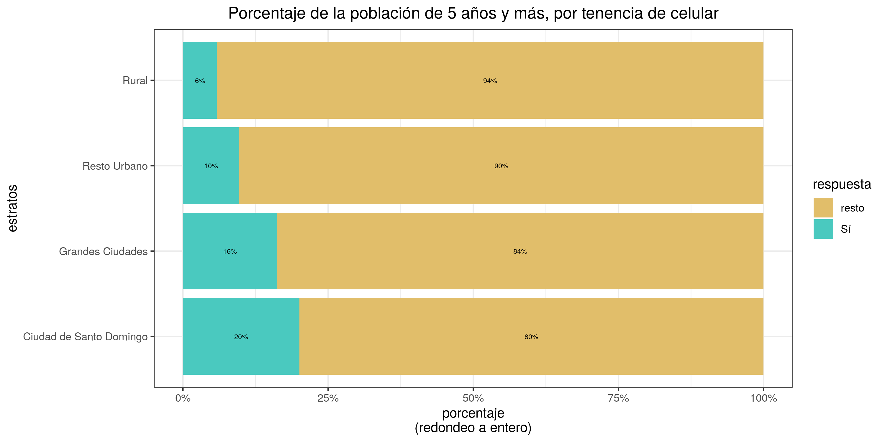

    ## 
    ## $resumen_tibble
    ## # A tibble: 2 x 3
    ##   urbano_rural     Sí resto
    ##   <fct>         <dbl> <dbl>
    ## 1 Urbano       0.155  0.845
    ## 2 Rural        0.0584 0.942
    ## 
    ## $resumen_md
    ## 
    ## 
    ## |urbano_rural |Sí    |resto |
    ## |:------------|:-----|:-----|
    ## |Urbano       |15.5% |84.5% |
    ## |Rural        |5.8%  |94.2% |
    ## 
    ## $gráfico

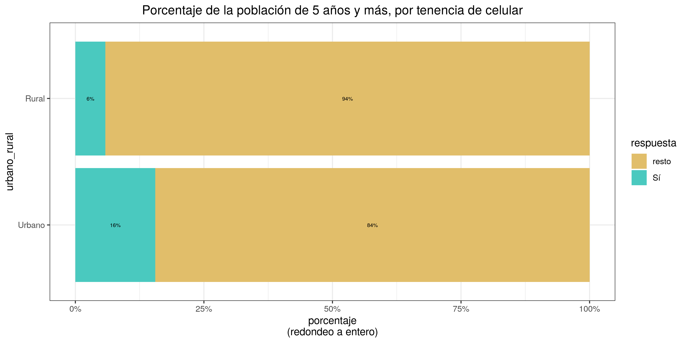

    ## 
    ## $resumen_tibble
    ## # A tibble: 2 x 3
    ##   hombre_mujer    Sí resto
    ##   <fct>        <dbl> <dbl>
    ## 1 Hombre       0.138 0.862
    ## 2 Mujer        0.136 0.864
    ## 
    ## $resumen_md
    ## 
    ## 
    ## |hombre_mujer |Sí    |resto |
    ## |:------------|:-----|:-----|
    ## |Hombre       |13.8% |86.2% |
    ## |Mujer        |13.6% |86.4% |
    ## 
    ## $gráfico

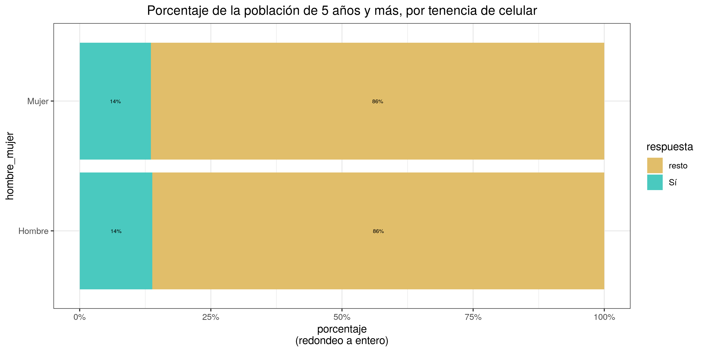

    ## 
    ## $resumen_tibble
    ## # A tibble: 5 x 3
    ##   grupo_socioecon        Sí resto
    ##   <fct>               <dbl> <dbl>
    ## 1 Muy bajo           0.0205 0.979
    ## 2 Bajo               0.0434 0.957
    ## 3 Medio bajo         0.0834 0.917
    ## 4 Medio y Medio alto 0.176  0.824
    ## 5 Alto               0.429  0.571
    ## 
    ## $resumen_md
    ## 
    ## 
    ## |grupo_socioecon    |Sí    |resto |
    ## |:------------------|:-----|:-----|
    ## |Muy bajo           |2.1%  |97.9% |
    ## |Bajo               |4.3%  |95.7% |
    ## |Medio bajo         |8.3%  |91.7% |
    ## |Medio y Medio alto |17.6% |82.4% |
    ## |Alto               |42.9% |57.1% |
    ## 
    ## $gráfico

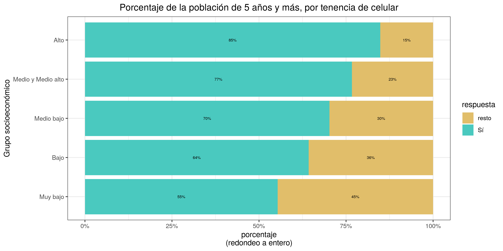

    ##                provincias   regiones     estratos    urbano_rural hombre_mujer
    ## resumen_tibble List,3       List,3       List,3      List,3       List,3      
    ## resumen_md     Character,34 Character,12 Character,6 Character,4  Character,4 
    ## gráfico        List,9       List,9       List,9      List,9       List,9      
    ##                grupo_socioecon
    ## resumen_tibble List,3         
    ## resumen_md     Character,7    
    ## gráfico        List,9
    
    
    # Exportar a imágenes
    sapply(
      categorias,
      function(x) {
        ba <- barras_apiladas_condicion_o(
          categorias = x,
          titulo_grafico = titulo_grafico,
          patron_cols = '^H406')
        jpeg(filename = paste0('img/', x, '_celular', '.jpg'), width = 1280, height = 1000, res = 150)
        print(ba$`gráfico`)
        dev.off()
      })
    ##      provincias.png        regiones.png        estratos.png    urbano_rural.png 
    ##                   2                   2                   2                   2 
    ##    hombre_mujer.png grupo_socioecon.png 
    ##                   2                   2

## Outreach

> ENHOGAR 2018, TIC. Y pensar que la \#raspberrypi usa la misma
> arquitectura de CPU que los celulares. En fin, que ampliar cobertura
> de docencia virtual, sin contar con el software libre, yo es que no lo
> veo


