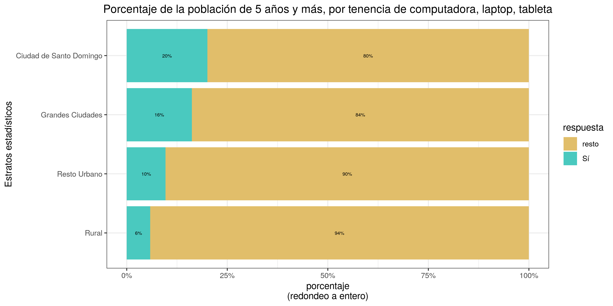
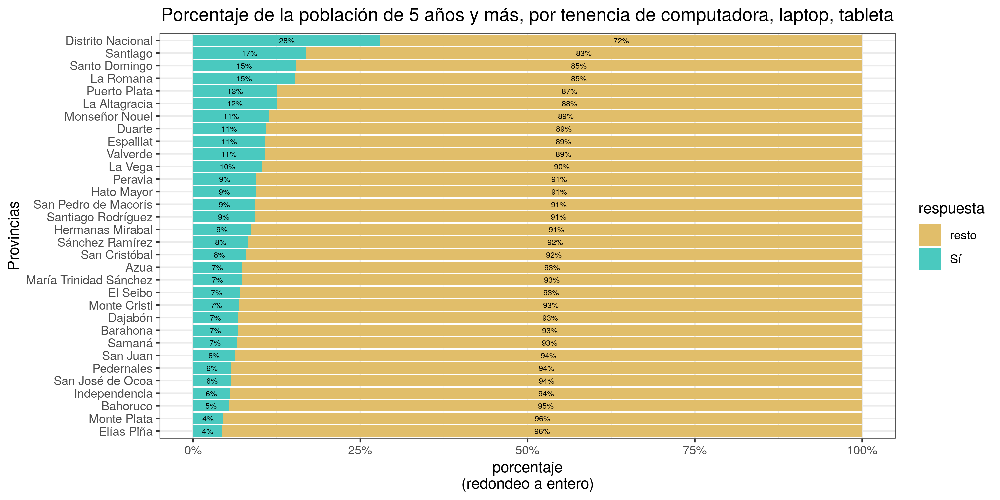
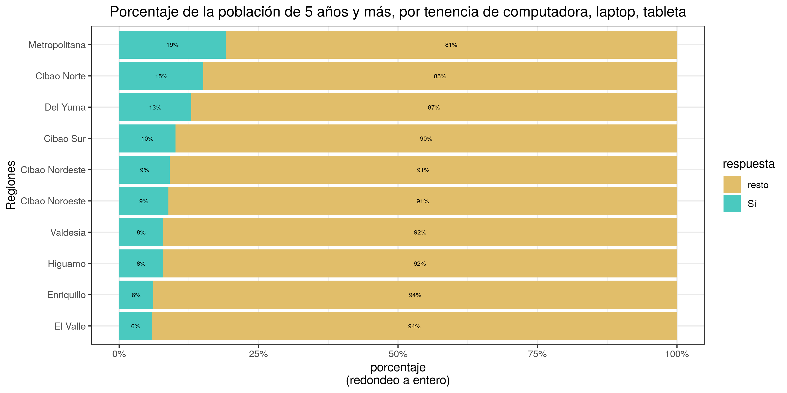
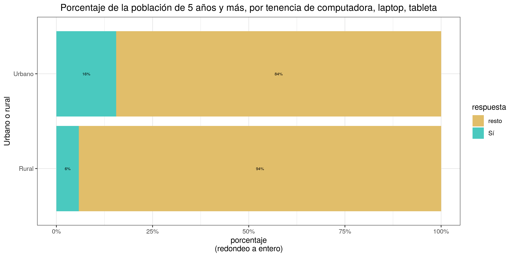

ENHOGAR-2018, TIC
================
José Ramón Martínez Batlle

<!-- Este .md fue generado a partir del .Rmd homónimo. Edítese el .Rmd -->


## Datos fuente

  - Archivo `Personas_ENH18.sav`
  - [URL
    directo](https://archivo.one.gob.do/catalogo-datos/datasets/ENHOGAR/ENHOGAR-2018-Base-SPSS-PUB/Personas_ENH18.sav)
  - [Página
    raíz](https://archivo.one.gob.do/recursos-automatizados/bases-de-datos)

## Paquetes, funciones

``` r
library(foreign)
source('R/funciones.R')
```

## Lectura y preparación de datos

``` r
d <- read.spss('data/Personas_ENH18.sav') 
nom_cols <- attr(d, 'variable.labels')
df <- as.data.frame(d)
colnames(df) <- nom_cols
df$`H203. ¿Cuántos años cumplidos tiene nombre?` <- as.numeric(
  as.character(df$`H203. ¿Cuántos años cumplidos tiene nombre?`))
levels(df$`H202. ¿Es (nombre) varón o hembra?`) <- c('Hombre', 'Mujer')
```

## Gráficos, resúmenes

### PC, laptops, tabletas

``` r
categorias <- c(
  'Estratos estadísticos' = 'HESTRAT. Estratos Geográficos',
  'Provincias' = 'HPROVI. Provincia',
  'Regiones' = 'Region. Regiones de planificación',
  'Urbano o rural' = 'HZONA. Zona de residencia',
  'Hombre o mujer' = '^H202',
  'Grupo socioeconómico' = '^grupsec',
  'Nivel educativo máximo' = '^H304',
  'Asistencia centro educativo' = '^H302',
  'Idioma materno' = '^H207')
titulo_grafico <- paste0('Porcentaje de la población de 5 años y más, ',
                         'por tenencia de computadora, laptop, tableta')

# Imprimir gráficos en este documento
sapply(
  seq_along(categorias),
  function(x) {
    ba <- barras_apiladas_condicion_o(
      categorias_col = categorias[x],
      categorias_lab = names(categorias[x]),
      titulo_grafico = titulo_grafico)
    print(ba)
  })
## $resumen_tibble
## # A tibble: 4 x 3
##   `Estratos estadísticos`     Sí resto
##   <fct>                    <dbl> <dbl>
## 1 Ciudad de Santo Domingo 0.200  0.800
## 2 Grandes Ciudades        0.162  0.838
## 3 Resto Urbano            0.0965 0.904
## 4 Rural                   0.0584 0.942
## 
## $resumen_md
## 
## 
## |Estratos estadísticos   |Sí    |resto |
## |:-----------------------|:-----|:-----|
## |Ciudad de Santo Domingo |20.0% |80.0% |
## |Grandes Ciudades        |16.2% |83.8% |
## |Resto Urbano            |9.6%  |90.4% |
## |Rural                   |5.8%  |94.2% |
## 
## $gráfico
```


    ## 
    ## $resumen_tibble
    ## # A tibble: 32 x 3
    ##    Provincias            Sí resto
    ##    <fct>              <dbl> <dbl>
    ##  1 Azua              0.0730 0.927
    ##  2 Bahoruco          0.0540 0.946
    ##  3 Barahona          0.0668 0.933
    ##  4 Dajabón           0.0670 0.933
    ##  5 Distrito Nacional 0.280  0.720
    ##  6 Duarte            0.108  0.892
    ##  7 El Seibo          0.0706 0.929
    ##  8 Elías Piña        0.0439 0.956
    ##  9 Espaillat         0.107  0.893
    ## 10 Hato Mayor        0.0939 0.906
    ## # … with 22 more rows
    ## 
    ## $resumen_md
    ## 
    ## 
    ## |Provincias             |Sí    |resto |
    ## |:----------------------|:-----|:-----|
    ## |Azua                   |7.3%  |92.7% |
    ## |Bahoruco               |5.4%  |94.6% |
    ## |Barahona               |6.7%  |93.3% |
    ## |Dajabón                |6.7%  |93.3% |
    ## |Distrito Nacional      |28.0% |72.0% |
    ## |Duarte                 |10.8% |89.2% |
    ## |El Seibo               |7.1%  |92.9% |
    ## |Elías Piña             |4.4%  |95.6% |
    ## |Espaillat              |10.7% |89.3% |
    ## |Hato Mayor             |9.4%  |90.6% |
    ## |Hermanas Mirabal       |8.7%  |91.3% |
    ## |Independencia          |5.5%  |94.5% |
    ## |La Altagracia          |12.5% |87.5% |
    ## |La Romana              |15.3% |84.7% |
    ## |La Vega                |10.3% |89.7% |
    ## |María Trinidad Sánchez |7.2%  |92.8% |
    ## |Monseñor Nouel         |11.4% |88.6% |
    ## |Monte Cristi           |6.9%  |93.1% |
    ## |Monte Plata            |4.4%  |95.6% |
    ## |Pedernales             |5.7%  |94.3% |
    ## |Peravia                |9.4%  |90.6% |
    ## |Puerto Plata           |12.5% |87.5% |
    ## |Samaná                 |6.6%  |93.4% |
    ## |San Cristóbal          |7.8%  |92.2% |
    ## |San José de Ocoa       |5.6%  |94.4% |
    ## |San Juan               |6.3%  |93.7% |
    ## |San Pedro de Macorís   |9.3%  |90.7% |
    ## |Sánchez Ramírez        |8.2%  |91.8% |
    ## |Santiago               |16.8% |83.2% |
    ## |Santiago Rodríguez     |9.2%  |90.8% |
    ## |Santo Domingo          |15.3% |84.7% |
    ## |Valverde               |10.7% |89.3% |
    ## 
    ## $gráfico


    ## 
    ## $resumen_tibble
    ## # A tibble: 10 x 3
    ##    Regiones           Sí resto
    ##    <fct>           <dbl> <dbl>
    ##  1 Cibao Nordeste 0.0909 0.909
    ##  2 Cibao Noroeste 0.0883 0.912
    ##  3 Cibao Norte    0.151  0.849
    ##  4 Cibao Sur      0.101  0.899
    ##  5 Del Yuma       0.129  0.871
    ##  6 El Valle       0.0588 0.941
    ##  7 Enriquillo     0.0610 0.939
    ##  8 Higuamo        0.0784 0.922
    ##  9 Metropolitana  0.191  0.809
    ## 10 Valdesia       0.0788 0.921
    ## 
    ## $resumen_md
    ## 
    ## 
    ## |Regiones       |Sí    |resto |
    ## |:--------------|:-----|:-----|
    ## |Cibao Nordeste |9.1%  |90.9% |
    ## |Cibao Noroeste |8.8%  |91.2% |
    ## |Cibao Norte    |15.1% |84.9% |
    ## |Cibao Sur      |10.1% |89.9% |
    ## |Del Yuma       |12.9% |87.1% |
    ## |El Valle       |5.9%  |94.1% |
    ## |Enriquillo     |6.1%  |93.9% |
    ## |Higuamo        |7.8%  |92.2% |
    ## |Metropolitana  |19.1% |80.9% |
    ## |Valdesia       |7.9%  |92.1% |
    ## 
    ## $gráfico


    ## 
    ## $resumen_tibble
    ## # A tibble: 2 x 3
    ##   `Urbano o rural`     Sí resto
    ##   <fct>             <dbl> <dbl>
    ## 1 Rural            0.0584 0.942
    ## 2 Urbano           0.155  0.845
    ## 
    ## $resumen_md
    ## 
    ## 
    ## |Urbano o rural |Sí    |resto |
    ## |:--------------|:-----|:-----|
    ## |Rural          |5.8%  |94.2% |
    ## |Urbano         |15.5% |84.5% |
    ## 
    ## $gráfico


    ## 
    ## $resumen_tibble
    ## # A tibble: 2 x 3
    ##   `Hombre o mujer`    Sí resto
    ##   <fct>            <dbl> <dbl>
    ## 1 Hombre           0.138 0.862
    ## 2 Mujer            0.136 0.864
    ## 
    ## $resumen_md
    ## 
    ## 
    ## |Hombre o mujer |Sí    |resto |
    ## |:--------------|:-----|:-----|
    ## |Hombre         |13.8% |86.2% |
    ## |Mujer          |13.6% |86.4% |
    ## 
    ## $gráfico


    ## 
    ## $resumen_tibble
    ## # A tibble: 5 x 3
    ##   `Grupo socioeconómico`     Sí resto
    ##   <fct>                   <dbl> <dbl>
    ## 1 Alto                   0.429  0.571
    ## 2 Bajo                   0.0434 0.957
    ## 3 Medio bajo             0.0834 0.917
    ## 4 Medio y Medio alto     0.176  0.824
    ## 5 Muy bajo               0.0205 0.979
    ## 
    ## $resumen_md
    ## 
    ## 
    ## |Grupo socioeconómico |Sí    |resto |
    ## |:--------------------|:-----|:-----|
    ## |Alto                 |42.9% |57.1% |
    ## |Bajo                 |4.3%  |95.7% |
    ## |Medio bajo           |8.3%  |91.7% |
    ## |Medio y Medio alto   |17.6% |82.4% |
    ## |Muy bajo             |2.1%  |97.9% |
    ## 
    ## $gráfico


    ## 
    ## $resumen_tibble
    ## # A tibble: 7 x 3
    ##   `Nivel educativo máximo`            Sí resto
    ##   <fct>                            <dbl> <dbl>
    ## 1 No sabe                         0.0351 0.965
    ## 2 Postgrado, Maestría o Doctorado 0.641  0.359
    ## 3 Preescolar o inicial            0.131  0.869
    ## 4 Primario o básico               0.0633 0.937
    ## 5 Secundario o Medio              0.105  0.895
    ## 6 Sin información                 0.0148 0.985
    ## 7 Universitario                   0.339  0.661
    ## 
    ## $resumen_md
    ## 
    ## 
    ## |Nivel educativo máximo          |Sí    |resto |
    ## |:-------------------------------|:-----|:-----|
    ## |No sabe                         |3.5%  |96.5% |
    ## |Postgrado, Maestría o Doctorado |64.1% |35.9% |
    ## |Preescolar o inicial            |13.1% |86.9% |
    ## |Primario o básico               |6.3%  |93.7% |
    ## |Secundario o Medio              |10.5% |89.5% |
    ## |Sin información                 |1.5%  |98.5% |
    ## |Universitario                   |33.9% |66.1% |
    ## 
    ## $gráfico


    ## 
    ## $resumen_tibble
    ## # A tibble: 4 x 3
    ##   `Asistencia centro educativo`     Sí resto
    ##   <fct>                          <dbl> <dbl>
    ## 1 No asiste, pero asistió       0.125  0.875
    ## 2 Nunca asistió                 0.0112 0.989
    ## 3 Si asiste                     0.171  0.829
    ## 4 Sin información               0.160  0.840
    ## 
    ## $resumen_md
    ## 
    ## 
    ## |Asistencia centro educativo |Sí    |resto |
    ## |:---------------------------|:-----|:-----|
    ## |No asiste, pero asistió     |12.5% |87.5% |
    ## |Nunca asistió               |1.1%  |98.9% |
    ## |Si asiste                   |17.1% |82.9% |
    ## |Sin información             |16.0% |84.0% |
    ## 
    ## $gráfico


    ## 
    ## $resumen_tibble
    ## # A tibble: 8 x 3
    ##   `Idioma materno`     Sí resto
    ##   <fct>             <dbl> <dbl>
    ## 1 Creole           0.0430 0.957
    ## 2 Español          0.139  0.861
    ## 3 Francés          0.639  0.361
    ## 4 Inglés           0.421  0.579
    ## 5 Italiano         0.488  0.512
    ## 6 Mandarín         0.493  0.507
    ## 7 Otro             0.433  0.567
    ## 8 Sin información  0.145  0.855
    ## 
    ## $resumen_md
    ## 
    ## 
    ## |Idioma materno  |Sí    |resto |
    ## |:---------------|:-----|:-----|
    ## |Creole          |4.3%  |95.7% |
    ## |Español         |13.9% |86.1% |
    ## |Francés         |63.9% |36.1% |
    ## |Inglés          |42.1% |57.9% |
    ## |Italiano        |48.8% |51.2% |
    ## |Mandarín        |49.3% |50.7% |
    ## |Otro            |43.3% |56.7% |
    ## |Sin información |14.5% |85.5% |
    ## 
    ## $gráfico


    ##                [,1]        [,2]         [,3]         [,4]        [,5]       
    ## resumen_tibble List,3      List,3       List,3       List,3      List,3     
    ## resumen_md     Character,6 Character,34 Character,12 Character,4 Character,4
    ## gráfico        List,9      List,9       List,9       List,9      List,9     
    ##                [,6]        [,7]        [,8]        [,9]        
    ## resumen_tibble List,3      List,3      List,3      List,3      
    ## resumen_md     Character,7 Character,9 Character,6 Character,10
    ## gráfico        List,9      List,9      List,9      List,9
    
    # Exportar a imágenes
    sapply(
      seq_along(categorias),
      function(x) {
        ba <- barras_apiladas_condicion_o(
          categorias_col = categorias[x],
          categorias_lab = names(categorias[x]),
          titulo_grafico = titulo_grafico)
        jpeg(
          filename = paste0('img/', names(categorias[x]), '_pc_tableta', '.jpg'),
          width = 1280, height = 1000, res = 150)
        print(ba$`gráfico`)
        dev.off()
      })
    ## png png png png png png png png png 
    ##   2   2   2   2   2   2   2   2   2

### Celulares

``` r
titulo_grafico <- 'Porcentaje de la población de 5 años y más, por tenencia de celular'

# Imprimir gráficos en este documento
sapply(
  seq_along(categorias),
  function(x) {
    ba <- barras_apiladas_condicion_o(
      categorias_col = categorias[x],
      categorias_lab = names(categorias[x]),
      titulo_grafico = titulo_grafico,
      patron_cols = '^H406')
    print(ba)
  })
## $resumen_tibble
## # A tibble: 4 x 3
##   `Estratos estadísticos`    Sí resto
##   <fct>                   <dbl> <dbl>
## 1 Ciudad de Santo Domingo 0.758 0.242
## 2 Grandes Ciudades        0.749 0.251
## 3 Resto Urbano            0.673 0.327
## 4 Rural                   0.622 0.378
## 
## $resumen_md
## 
## 
## |Estratos estadísticos   |Sí    |resto |
## |:-----------------------|:-----|:-----|
## |Ciudad de Santo Domingo |75.8% |24.2% |
## |Grandes Ciudades        |74.9% |25.1% |
## |Resto Urbano            |67.3% |32.7% |
## |Rural                   |62.2% |37.8% |
## 
## $gráfico
```



    ## 
    ## $resumen_tibble
    ## # A tibble: 32 x 3
    ##    Provincias           Sí resto
    ##    <fct>             <dbl> <dbl>
    ##  1 Azua              0.598 0.402
    ##  2 Bahoruco          0.540 0.460
    ##  3 Barahona          0.570 0.430
    ##  4 Dajabón           0.670 0.330
    ##  5 Distrito Nacional 0.773 0.227
    ##  6 Duarte            0.668 0.332
    ##  7 El Seibo          0.624 0.376
    ##  8 Elías Piña        0.468 0.532
    ##  9 Espaillat         0.707 0.293
    ## 10 Hato Mayor        0.682 0.318
    ## # … with 22 more rows
    ## 
    ## $resumen_md
    ## 
    ## 
    ## |Provincias             |Sí    |resto |
    ## |:----------------------|:-----|:-----|
    ## |Azua                   |59.8% |40.2% |
    ## |Bahoruco               |54.0% |46.0% |
    ## |Barahona               |57.0% |43.0% |
    ## |Dajabón                |67.0% |33.0% |
    ## |Distrito Nacional      |77.3% |22.7% |
    ## |Duarte                 |66.8% |33.2% |
    ## |El Seibo               |62.4% |37.6% |
    ## |Elías Piña             |46.8% |53.2% |
    ## |Espaillat              |70.7% |29.3% |
    ## |Hato Mayor             |68.2% |31.8% |
    ## |Hermanas Mirabal       |70.8% |29.2% |
    ## |Independencia          |53.2% |46.8% |
    ## |La Altagracia          |80.4% |19.6% |
    ## |La Romana              |73.5% |26.5% |
    ## |La Vega                |67.5% |32.5% |
    ## |María Trinidad Sánchez |69.1% |30.9% |
    ## |Monseñor Nouel         |72.3% |27.7% |
    ## |Monte Cristi           |66.4% |33.6% |
    ## |Monte Plata            |60.1% |39.9% |
    ## |Pedernales             |49.5% |50.5% |
    ## |Peravia                |71.6% |28.4% |
    ## |Puerto Plata           |69.3% |30.7% |
    ## |Samaná                 |67.1% |32.9% |
    ## |San Cristóbal          |67.5% |32.5% |
    ## |San José de Ocoa       |66.0% |34.0% |
    ## |San Juan               |57.4% |42.6% |
    ## |San Pedro de Macorís   |70.5% |29.5% |
    ## |Sánchez Ramírez        |66.0% |34.0% |
    ## |Santiago               |73.8% |26.2% |
    ## |Santiago Rodríguez     |64.9% |35.1% |
    ## |Santo Domingo          |74.0% |26.0% |
    ## |Valverde               |68.9% |31.1% |
    ## 
    ## $gráfico



    ## 
    ## $resumen_tibble
    ## # A tibble: 10 x 3
    ##    Regiones          Sí resto
    ##    <fct>          <dbl> <dbl>
    ##  1 Cibao Nordeste 0.679 0.321
    ##  2 Cibao Noroeste 0.674 0.326
    ##  3 Cibao Norte    0.724 0.276
    ##  4 Cibao Sur      0.684 0.316
    ##  5 Del Yuma       0.752 0.248
    ##  6 El Valle       0.553 0.447
    ##  7 Enriquillo     0.551 0.449
    ##  8 Higuamo        0.670 0.330
    ##  9 Metropolitana  0.750 0.250
    ## 10 Valdesia       0.665 0.335
    ## 
    ## $resumen_md
    ## 
    ## 
    ## |Regiones       |Sí    |resto |
    ## |:--------------|:-----|:-----|
    ## |Cibao Nordeste |67.9% |32.1% |
    ## |Cibao Noroeste |67.4% |32.6% |
    ## |Cibao Norte    |72.4% |27.6% |
    ## |Cibao Sur      |68.4% |31.6% |
    ## |Del Yuma       |75.2% |24.8% |
    ## |El Valle       |55.3% |44.7% |
    ## |Enriquillo     |55.1% |44.9% |
    ## |Higuamo        |67.0% |33.0% |
    ## |Metropolitana  |75.0% |25.0% |
    ## |Valdesia       |66.5% |33.5% |
    ## 
    ## $gráfico



    ## 
    ## $resumen_tibble
    ## # A tibble: 2 x 3
    ##   `Urbano o rural`    Sí resto
    ##   <fct>            <dbl> <dbl>
    ## 1 Rural            0.622 0.378
    ## 2 Urbano           0.726 0.274
    ## 
    ## $resumen_md
    ## 
    ## 
    ## |Urbano o rural |Sí    |resto |
    ## |:--------------|:-----|:-----|
    ## |Rural          |62.2% |37.8% |
    ## |Urbano         |72.6% |27.4% |
    ## 
    ## $gráfico



    ## 
    ## $resumen_tibble
    ## # A tibble: 2 x 3
    ##   `Hombre o mujer`    Sí resto
    ##   <fct>            <dbl> <dbl>
    ## 1 Hombre           0.710 0.290
    ## 2 Mujer            0.704 0.296
    ## 
    ## $resumen_md
    ## 
    ## 
    ## |Hombre o mujer |Sí    |resto |
    ## |:--------------|:-----|:-----|
    ## |Hombre         |71.0% |29.0% |
    ## |Mujer          |70.4% |29.6% |
    ## 
    ## $gráfico


    ## 
    ## $resumen_tibble
    ## # A tibble: 5 x 3
    ##   `Grupo socioeconómico`    Sí resto
    ##   <fct>                  <dbl> <dbl>
    ## 1 Alto                   0.848 0.152
    ## 2 Bajo                   0.643 0.357
    ## 3 Medio bajo             0.702 0.298
    ## 4 Medio y Medio alto     0.767 0.233
    ## 5 Muy bajo               0.553 0.447
    ## 
    ## $resumen_md
    ## 
    ## 
    ## |Grupo socioeconómico |Sí    |resto |
    ## |:--------------------|:-----|:-----|
    ## |Alto                 |84.8% |15.2% |
    ## |Bajo                 |64.3% |35.7% |
    ## |Medio bajo           |70.2% |29.8% |
    ## |Medio y Medio alto   |76.7% |23.3% |
    ## |Muy bajo             |55.3% |44.7% |
    ## 
    ## $gráfico


    ## 
    ## $resumen_tibble
    ## # A tibble: 7 x 3
    ##   `Nivel educativo máximo`           Sí  resto
    ##   <fct>                           <dbl>  <dbl>
    ## 1 No sabe                         0.737 0.263 
    ## 2 Postgrado, Maestría o Doctorado 0.989 0.0109
    ## 3 Preescolar o inicial            0.119 0.881 
    ## 4 Primario o básico               0.512 0.488 
    ## 5 Secundario o Medio              0.854 0.146 
    ## 6 Sin información                 0.403 0.597 
    ## 7 Universitario                   0.971 0.0289
    ## 
    ## $resumen_md
    ## 
    ## 
    ## |Nivel educativo máximo          |Sí    |resto |
    ## |:-------------------------------|:-----|:-----|
    ## |No sabe                         |73.7% |26.3% |
    ## |Postgrado, Maestría o Doctorado |98.9% |1.1%  |
    ## |Preescolar o inicial            |11.9% |88.1% |
    ## |Primario o básico               |51.2% |48.8% |
    ## |Secundario o Medio              |85.4% |14.6% |
    ## |Sin información                 |40.3% |59.7% |
    ## |Universitario                   |97.1% |2.9%  |
    ## 
    ## $gráfico


    ## 
    ## $resumen_tibble
    ## # A tibble: 4 x 3
    ##   `Asistencia centro educativo`     Sí resto
    ##   <fct>                          <dbl> <dbl>
    ## 1 No asiste, pero asistió       0.844  0.156
    ## 2 Nunca asistió                 0.407  0.593
    ## 3 Si asiste                     0.466  0.534
    ## 4 Sin información               0.0947 0.905
    ## 
    ## $resumen_md
    ## 
    ## 
    ## |Asistencia centro educativo |Sí    |resto |
    ## |:---------------------------|:-----|:-----|
    ## |No asiste, pero asistió     |84.4% |15.6% |
    ## |Nunca asistió               |40.7% |59.3% |
    ## |Si asiste                   |46.6% |53.4% |
    ## |Sin información             |9.5%  |90.5% |
    ## 
    ## $gráfico


    ## 
    ## $resumen_tibble
    ## # A tibble: 8 x 3
    ##   `Idioma materno`     Sí  resto
    ##   <fct>             <dbl>  <dbl>
    ## 1 Creole           0.683  0.317 
    ## 2 Español          0.780  0.220 
    ## 3 Francés          0.902  0.0976
    ## 4 Inglés           0.846  0.154 
    ## 5 Italiano         0.889  0.111 
    ## 6 Mandarín         1      0     
    ## 7 Otro             0.758  0.242 
    ## 8 Sin información  0.0531 0.947 
    ## 
    ## $resumen_md
    ## 
    ## 
    ## |Idioma materno  |Sí     |resto |
    ## |:---------------|:------|:-----|
    ## |Creole          |68.3%  |31.7% |
    ## |Español         |78.0%  |22.0% |
    ## |Francés         |90.2%  |9.8%  |
    ## |Inglés          |84.6%  |15.4% |
    ## |Italiano        |88.9%  |11.1% |
    ## |Mandarín        |100.0% |0.0%  |
    ## |Otro            |75.8%  |24.2% |
    ## |Sin información |5.3%   |94.7% |
    ## 
    ## $gráfico


    ##                [,1]        [,2]         [,3]         [,4]        [,5]       
    ## resumen_tibble List,3      List,3       List,3       List,3      List,3     
    ## resumen_md     Character,6 Character,34 Character,12 Character,4 Character,4
    ## gráfico        List,9      List,9       List,9       List,9      List,9     
    ##                [,6]        [,7]        [,8]        [,9]        
    ## resumen_tibble List,3      List,3      List,3      List,3      
    ## resumen_md     Character,7 Character,9 Character,6 Character,10
    ## gráfico        List,9      List,9      List,9      List,9
    
    
    # Exportar a imágenes
    sapply(
      seq_along(categorias),
      function(x) {
        ba <- barras_apiladas_condicion_o(
          categorias_col = categorias[x],
          categorias_lab = names(categorias[x]),
          titulo_grafico = titulo_grafico,
          patron_cols = '^H406')
        jpeg(
          filename = paste0('img/', names(categorias[x]), '_celular', '.jpg'),
          width = 1280, height = 1000, res = 150)
        print(ba$`gráfico`)
        dev.off()
      })
    ## png png png png png png png png png 
    ##   2   2   2   2   2   2   2   2   2

## Outreach

> ENHOGAR 2018. ¿Celular o PC? Y pensar que la \#raspberrypi usa la
> misma arquitectura del celular, por la mitad de precio. En fin, que
> ampliar cobertura de la virtualidad, sin software libre, yo es que no
> lo veo. Datos @ONERD\_ <https://github.com/geofis/enhogar-2018>
