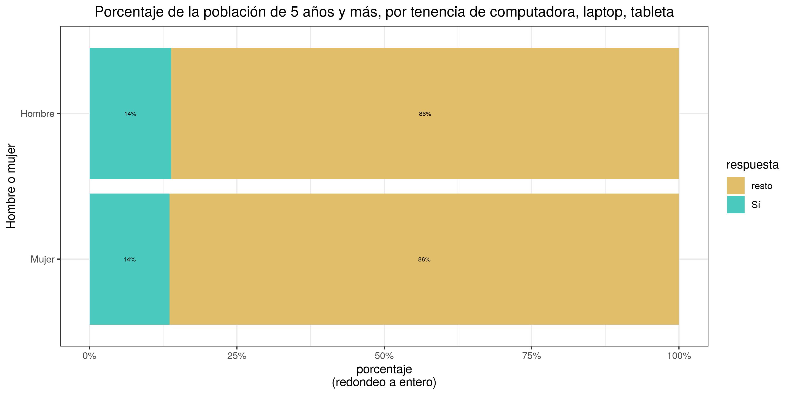

ENHOGAR-2018, TIC
================
José Ramón Martínez Batlle

<!-- Este .md fue generado a partir del .Rmd homónimo. Edítese el .Rmd -->


## Datos fuente

  - Archivo `Personas_ENH18.sav`
  - [URL
    directo](https://archivo.one.gob.do/catalogo-datos/datasets/ENHOGAR/ENHOGAR-2018-Base-SPSS-PUB/Personas_ENH18.sav)
  - [Página
    raíz](https://archivo.one.gob.do/recursos-automatizados/bases-de-datos)

## Paquetes, funciones

``` r
library(foreign)
library(knitr)
source('R/funciones.R')
```

## Lectura y preparación de datos

``` r
d <- read.spss('data/Personas_ENH18.sav') 
nom_cols <- attr(d, 'variable.labels')
df <- as.data.frame(d)
colnames(df) <- nom_cols
df$`H203. ¿Cuántos años cumplidos tiene nombre?` <- as.numeric(
  as.character(df$`H203. ¿Cuántos años cumplidos tiene nombre?`))
levels(df$`H202. ¿Es (nombre) varón o hembra?`) <- c('Hombre', 'Mujer')
```

## Gráficos, resúmenes

### PC, laptops, tabletas

#### Generar lista de gráficos y tablas

``` r
categorias <- c(
  'Estratos estadísticos' = 'HESTRAT. Estratos Geográficos',
  'Provincias' = 'HPROVI. Provincia',
  'Regiones' = 'Region. Regiones de planificación',
  'Urbano o rural' = 'HZONA. Zona de residencia',
  'Hombre o mujer' = '^H202',
  'Grupo socioeconómico' = '^grupsec',
  'Nivel educativo máximo' = '^H304',
  'Asistencia centro educativo' = '^H302',
  'Idioma materno' = '^H207')
titulo_grafico <- paste0('Porcentaje de la población de 5 años y más, ',
                         'por tenencia de computadora, laptop, tableta')
pc <- lapply(
  seq_along(categorias),
  function(x) {
    rp <- barras_apiladas_condicion_o(
      patron_cols = c('H401|^H402|^H403'),
      categorias_col = categorias[x],
      categorias_lab = names(categorias[x]),
      titulo_grafico = titulo_grafico)
    return(rp)
  })
names(pc) <- paste(titulo_grafico, 'por', tolower(names(categorias)))
```

#### Imprimir gráficos en este documento

``` r
sapply(names(pc), function(x) pc[[x]][['gráfico']], simplify = F)
```

$`Porcentaje de la población de 5 años y más, por tenencia de
computadora, laptop, tableta por estratos estadísticos`
 $`Porcentaje de la
población de 5 años y más, por tenencia de computadora, laptop, tableta
por provincias` 
$`Porcentaje de la población de 5 años y más, por tenencia de
computadora, laptop, tableta por regiones`
 $`Porcentaje de la
población de 5 años y más, por tenencia de computadora, laptop, tableta
por urbano o rural` 
$`Porcentaje de la población de 5 años y más, por tenencia de
computadora, laptop, tableta por hombre o mujer`
 $`Porcentaje de la
población de 5 años y más, por tenencia de computadora, laptop, tableta
por grupo socioeconómico`
 $`Porcentaje de la
población de 5 años y más, por tenencia de computadora, laptop, tableta
por nivel educativo máximo`
 $`Porcentaje de la
población de 5 años y más, por tenencia de computadora, laptop, tableta
por asistencia centro educativo`
 $`Porcentaje de la
población de 5 años y más, por tenencia de computadora, laptop, tableta
por idioma materno` 

#### Imprimir tablas en este documento

``` r
sapply(names(pc), function(x) pc[[x]][['resumen_md']], simplify = F)
```

$`Porcentaje de la población de 5 años y más, por tenencia de
computadora, laptop, tableta por estratos estadísticos`

| Estratos estadísticos   | Sí    | resto |
| :---------------------- | :---- | :---- |
| Ciudad de Santo Domingo | 20.0% | 80.0% |
| Grandes Ciudades        | 16.2% | 83.8% |
| Resto Urbano            | 9.6%  | 90.4% |
| Rural                   | 5.8%  | 94.2% |

$`Porcentaje de la población de 5 años y más, por tenencia de
computadora, laptop, tableta por provincias`

| Provincias             | Sí    | resto |
| :--------------------- | :---- | :---- |
| Azua                   | 7.3%  | 92.7% |
| Bahoruco               | 5.4%  | 94.6% |
| Barahona               | 6.7%  | 93.3% |
| Dajabón                | 6.7%  | 93.3% |
| Distrito Nacional      | 28.0% | 72.0% |
| Duarte                 | 10.8% | 89.2% |
| El Seibo               | 7.1%  | 92.9% |
| Elías Piña             | 4.4%  | 95.6% |
| Espaillat              | 10.7% | 89.3% |
| Hato Mayor             | 9.4%  | 90.6% |
| Hermanas Mirabal       | 8.7%  | 91.3% |
| Independencia          | 5.5%  | 94.5% |
| La Altagracia          | 12.5% | 87.5% |
| La Romana              | 15.3% | 84.7% |
| La Vega                | 10.3% | 89.7% |
| María Trinidad Sánchez | 7.2%  | 92.8% |
| Monseñor Nouel         | 11.4% | 88.6% |
| Monte Cristi           | 6.9%  | 93.1% |
| Monte Plata            | 4.4%  | 95.6% |
| Pedernales             | 5.7%  | 94.3% |
| Peravia                | 9.4%  | 90.6% |
| Puerto Plata           | 12.5% | 87.5% |
| Samaná                 | 6.6%  | 93.4% |
| San Cristóbal          | 7.8%  | 92.2% |
| San José de Ocoa       | 5.6%  | 94.4% |
| San Juan               | 6.3%  | 93.7% |
| San Pedro de Macorís   | 9.3%  | 90.7% |
| Sánchez Ramírez        | 8.2%  | 91.8% |
| Santiago               | 16.8% | 83.2% |
| Santiago Rodríguez     | 9.2%  | 90.8% |
| Santo Domingo          | 15.3% | 84.7% |
| Valverde               | 10.7% | 89.3% |

$`Porcentaje de la población de 5 años y más, por tenencia de
computadora, laptop, tableta por regiones`

| Regiones       | Sí    | resto |
| :------------- | :---- | :---- |
| Cibao Nordeste | 9.1%  | 90.9% |
| Cibao Noroeste | 8.8%  | 91.2% |
| Cibao Norte    | 15.1% | 84.9% |
| Cibao Sur      | 10.1% | 89.9% |
| Del Yuma       | 12.9% | 87.1% |
| El Valle       | 5.9%  | 94.1% |
| Enriquillo     | 6.1%  | 93.9% |
| Higuamo        | 7.8%  | 92.2% |
| Metropolitana  | 19.1% | 80.9% |
| Valdesia       | 7.9%  | 92.1% |

$`Porcentaje de la población de 5 años y más, por tenencia de
computadora, laptop, tableta por urbano o rural`

| Urbano o rural | Sí    | resto |
| :------------- | :---- | :---- |
| Rural          | 5.8%  | 94.2% |
| Urbano         | 15.5% | 84.5% |

$`Porcentaje de la población de 5 años y más, por tenencia de
computadora, laptop, tableta por hombre o mujer`

| Hombre o mujer | Sí    | resto |
| :------------- | :---- | :---- |
| Hombre         | 13.8% | 86.2% |
| Mujer          | 13.6% | 86.4% |

$`Porcentaje de la población de 5 años y más, por tenencia de
computadora, laptop, tableta por grupo socioeconómico`

| Grupo socioeconómico | Sí    | resto |
| :------------------- | :---- | :---- |
| Alto                 | 42.9% | 57.1% |
| Bajo                 | 4.3%  | 95.7% |
| Medio bajo           | 8.3%  | 91.7% |
| Medio y Medio alto   | 17.6% | 82.4% |
| Muy bajo             | 2.1%  | 97.9% |

$`Porcentaje de la población de 5 años y más, por tenencia de
computadora, laptop, tableta por nivel educativo máximo`

| Nivel educativo máximo          | Sí    | resto |
| :------------------------------ | :---- | :---- |
| No sabe                         | 3.5%  | 96.5% |
| Postgrado, Maestría o Doctorado | 64.1% | 35.9% |
| Preescolar o inicial            | 13.1% | 86.9% |
| Primario o básico               | 6.3%  | 93.7% |
| Secundario o Medio              | 10.5% | 89.5% |
| Sin información                 | 1.5%  | 98.5% |
| Universitario                   | 33.9% | 66.1% |

$`Porcentaje de la población de 5 años y más, por tenencia de
computadora, laptop, tableta por asistencia centro educativo`

| Asistencia centro educativo | Sí    | resto |
| :-------------------------- | :---- | :---- |
| No asiste, pero asistió     | 12.5% | 87.5% |
| Nunca asistió               | 1.1%  | 98.9% |
| Si asiste                   | 17.1% | 82.9% |
| Sin información             | 16.0% | 84.0% |

$`Porcentaje de la población de 5 años y más, por tenencia de
computadora, laptop, tableta por idioma materno`

| Idioma materno  | Sí    | resto |
| :-------------- | :---- | :---- |
| Creole          | 4.3%  | 95.7% |
| Español         | 13.9% | 86.1% |
| Francés         | 63.9% | 36.1% |
| Inglés          | 42.1% | 57.9% |
| Italiano        | 48.8% | 51.2% |
| Mandarín        | 49.3% | 50.7% |
| Otro            | 43.3% | 56.7% |
| Sin información | 14.5% | 85.5% |

#### Exportar a imágenes

``` r
sapply(
  seq_along(categorias),
  function(x) {
    ba <- barras_apiladas_condicion_o(
      categorias_col = categorias[x],
      categorias_lab = names(categorias[x]),
      titulo_grafico = titulo_grafico)
    jpeg(
      filename = paste0('img/', names(categorias[x]), '_pc_tableta', '.jpg'),
      width = 1280, height = 1000, res = 150)
    print(ba$`gráfico`)
    dev.off()
  })
## png png png png png png png png png 
##   2   2   2   2   2   2   2   2   2
```

### Celulares

#### Generar lista de gráficos y tablas

``` r
titulo_grafico <- 'Porcentaje de la población de 5 años y más, por tenencia de celular'
celular <- lapply(
  seq_along(categorias),
  function(x) {
    rp <- barras_apiladas_condicion_o(
      categorias_col = categorias[x],
      categorias_lab = names(categorias[x]),
      titulo_grafico = titulo_grafico,
      patron_cols = '^H406')
    return(rp)
  })
names(celular) <- paste(titulo_grafico, 'por', tolower(names(categorias)))
```

#### Imprimir gráficos en este documento

``` r
sapply(names(celular), function(x) celular[[x]][['gráfico']], simplify = F)
```

$`Porcentaje de la población de 5 años y más, por tenencia de celular
por estratos estadísticos`
 $`Porcentaje de la
población de 5 años y más, por tenencia de celular por provincias`
 $`Porcentaje de la
población de 5 años y más, por tenencia de celular por regiones`
 $`Porcentaje de la
población de 5 años y más, por tenencia de celular por urbano o rural`
 $`Porcentaje de la
población de 5 años y más, por tenencia de celular por hombre o mujer`
 $`Porcentaje de la
población de 5 años y más, por tenencia de celular por grupo
socioeconómico` 
$`Porcentaje de la población de 5 años y más, por tenencia de celular
por nivel educativo máximo`
 $`Porcentaje de la
población de 5 años y más, por tenencia de celular por asistencia centro
educativo` 
$`Porcentaje de la población de 5 años y más, por tenencia de celular
por idioma materno` 

#### Imprimir tablas en este documento

``` r
sapply(names(celular), function(x) celular[[x]][['resumen_md']], simplify = F)
```

$`Porcentaje de la población de 5 años y más, por tenencia de celular
por estratos estadísticos`

| Estratos estadísticos   | Sí    | resto |
| :---------------------- | :---- | :---- |
| Ciudad de Santo Domingo | 75.8% | 24.2% |
| Grandes Ciudades        | 74.9% | 25.1% |
| Resto Urbano            | 67.3% | 32.7% |
| Rural                   | 62.2% | 37.8% |

$`Porcentaje de la población de 5 años y más, por tenencia de celular
por provincias`

| Provincias             | Sí    | resto |
| :--------------------- | :---- | :---- |
| Azua                   | 59.8% | 40.2% |
| Bahoruco               | 54.0% | 46.0% |
| Barahona               | 57.0% | 43.0% |
| Dajabón                | 67.0% | 33.0% |
| Distrito Nacional      | 77.3% | 22.7% |
| Duarte                 | 66.8% | 33.2% |
| El Seibo               | 62.4% | 37.6% |
| Elías Piña             | 46.8% | 53.2% |
| Espaillat              | 70.7% | 29.3% |
| Hato Mayor             | 68.2% | 31.8% |
| Hermanas Mirabal       | 70.8% | 29.2% |
| Independencia          | 53.2% | 46.8% |
| La Altagracia          | 80.4% | 19.6% |
| La Romana              | 73.5% | 26.5% |
| La Vega                | 67.5% | 32.5% |
| María Trinidad Sánchez | 69.1% | 30.9% |
| Monseñor Nouel         | 72.3% | 27.7% |
| Monte Cristi           | 66.4% | 33.6% |
| Monte Plata            | 60.1% | 39.9% |
| Pedernales             | 49.5% | 50.5% |
| Peravia                | 71.6% | 28.4% |
| Puerto Plata           | 69.3% | 30.7% |
| Samaná                 | 67.1% | 32.9% |
| San Cristóbal          | 67.5% | 32.5% |
| San José de Ocoa       | 66.0% | 34.0% |
| San Juan               | 57.4% | 42.6% |
| San Pedro de Macorís   | 70.5% | 29.5% |
| Sánchez Ramírez        | 66.0% | 34.0% |
| Santiago               | 73.8% | 26.2% |
| Santiago Rodríguez     | 64.9% | 35.1% |
| Santo Domingo          | 74.0% | 26.0% |
| Valverde               | 68.9% | 31.1% |

$`Porcentaje de la población de 5 años y más, por tenencia de celular
por regiones`

| Regiones       | Sí    | resto |
| :------------- | :---- | :---- |
| Cibao Nordeste | 67.9% | 32.1% |
| Cibao Noroeste | 67.4% | 32.6% |
| Cibao Norte    | 72.4% | 27.6% |
| Cibao Sur      | 68.4% | 31.6% |
| Del Yuma       | 75.2% | 24.8% |
| El Valle       | 55.3% | 44.7% |
| Enriquillo     | 55.1% | 44.9% |
| Higuamo        | 67.0% | 33.0% |
| Metropolitana  | 75.0% | 25.0% |
| Valdesia       | 66.5% | 33.5% |

$`Porcentaje de la población de 5 años y más, por tenencia de celular
por urbano o rural`

| Urbano o rural | Sí    | resto |
| :------------- | :---- | :---- |
| Rural          | 62.2% | 37.8% |
| Urbano         | 72.6% | 27.4% |

$`Porcentaje de la población de 5 años y más, por tenencia de celular
por hombre o mujer`

| Hombre o mujer | Sí    | resto |
| :------------- | :---- | :---- |
| Hombre         | 71.0% | 29.0% |
| Mujer          | 70.4% | 29.6% |

$`Porcentaje de la población de 5 años y más, por tenencia de celular
por grupo socioeconómico`

| Grupo socioeconómico | Sí    | resto |
| :------------------- | :---- | :---- |
| Alto                 | 84.8% | 15.2% |
| Bajo                 | 64.3% | 35.7% |
| Medio bajo           | 70.2% | 29.8% |
| Medio y Medio alto   | 76.7% | 23.3% |
| Muy bajo             | 55.3% | 44.7% |

$`Porcentaje de la población de 5 años y más, por tenencia de celular
por nivel educativo máximo`

| Nivel educativo máximo          | Sí    | resto |
| :------------------------------ | :---- | :---- |
| No sabe                         | 73.7% | 26.3% |
| Postgrado, Maestría o Doctorado | 98.9% | 1.1%  |
| Preescolar o inicial            | 11.9% | 88.1% |
| Primario o básico               | 51.2% | 48.8% |
| Secundario o Medio              | 85.4% | 14.6% |
| Sin información                 | 40.3% | 59.7% |
| Universitario                   | 97.1% | 2.9%  |

$`Porcentaje de la población de 5 años y más, por tenencia de celular
por asistencia centro educativo`

| Asistencia centro educativo | Sí    | resto |
| :-------------------------- | :---- | :---- |
| No asiste, pero asistió     | 84.4% | 15.6% |
| Nunca asistió               | 40.7% | 59.3% |
| Si asiste                   | 46.6% | 53.4% |
| Sin información             | 9.5%  | 90.5% |

$`Porcentaje de la población de 5 años y más, por tenencia de celular
por idioma materno`

| Idioma materno  | Sí     | resto |
| :-------------- | :----- | :---- |
| Creole          | 68.3%  | 31.7% |
| Español         | 78.0%  | 22.0% |
| Francés         | 90.2%  | 9.8%  |
| Inglés          | 84.6%  | 15.4% |
| Italiano        | 88.9%  | 11.1% |
| Mandarín        | 100.0% | 0.0%  |
| Otro            | 75.8%  | 24.2% |
| Sin información | 5.3%   | 94.7% |

#### Exportar a imágenes

``` r
sapply(
  seq_along(categorias),
  function(x) {
    ba <- barras_apiladas_condicion_o(
      categorias_col = categorias[x],
      categorias_lab = names(categorias[x]),
      titulo_grafico = titulo_grafico,
      patron_cols = '^H406')
    jpeg(
      filename = paste0('img/', names(categorias[x]), '_celular', '.jpg'),
      width = 1280, height = 1000, res = 150)
    print(ba$`gráfico`)
    dev.off()
  })
## png png png png png png png png png 
##   2   2   2   2   2   2   2   2   2
```

## Outreach

> ENHOGAR 2018. ¿Celular o PC? Y pensar que la \#raspberrypi usa la
> misma arquitectura del celular, por la mitad de precio. En fin, que
> ampliar cobertura de la virtualidad, sin software libre, yo es que no
> lo veo. Datos @ONERD\_ <https://github.com/geofis/enhogar-2018>
